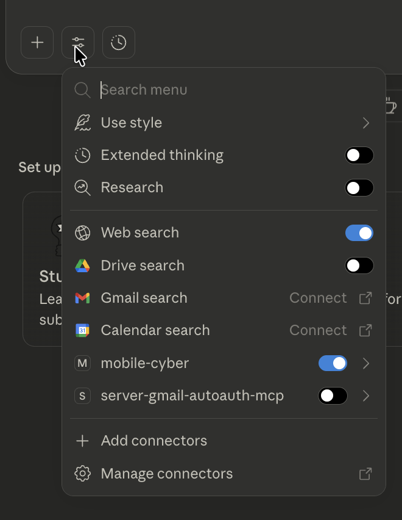

# Claude Desktop MCP Server Setup

Note: This document is a draft and may contain errors. It’s intended to help others replicate the MCP server setup for Claude and perform initial experiments.

## Prerequisites

- Claude Desktop installed (https://claude.ai/download)
- Docker Desktop running with `kali-container` started
- Android Emulator running
- Python venv with dependencies: `pip install -r requirements.txt`
- Note: the `requirements.txt` is not complete and you may have to install some libraries as needed.

**Note:** The MCP server runs automatically when Claude Desktop starts - no manual start needed!

## Setup Steps

### 1. Get Your Project Path

```bash
cd /path/to/mobilecybench
pwd  # Copy this absolute path
```

### 2. Configure Claude Desktop

* [Official MCP Documentation](https://modelcontextprotocol.io/docs/develop/connect-local-servers)

* **macOS:** `~/Library/Application Support/Claude/claude_desktop_config.json`
* **Windows:** `%APPDATA%\Claude\claude_desktop_config.json`

```json
{
  "mcpServers": {
    "mobile-cyber": {
      "command": "/ABSOLUTE/PATH/TO/mobilecybench/.venv/bin/python3",
      "args": ["/ABSOLUTE/PATH/TO/mobilecybench/agent/mcp/mcp_server_claude.py"],
      "env": {},
      "cwd": "/ABSOLUTE/PATH/TO/mobilecybench"
    }
  }
}
```

**Replace** `/ABSOLUTE/PATH/TO/mobilecybench` with your path from Step 1.

### 3. Check Kali and emulator connection

```bash
docker exec kali-container adb devices
```

### 4. Restart Claude Desktop


### 5. Verify & Test

You should see `mobile-cyber` with 3 tools.



**Try these:**
- "List all available tools from mobile-cyber"
- "Open Chrome on the emulator"

## Troubleshooting

**Tools not showing?**
- Test manually: `.venv/bin/python3 agent/mcp/mcp_server_claude.py` (should start without errors)

**Docker errors?**
- Ensure `kali-container` is running: `docker ps | grep kali`
