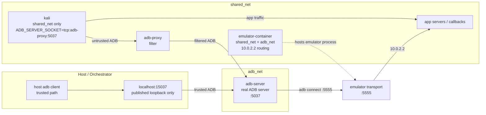

# ADB Network Isolation Design

## Problem

PR #817 added an ADB filtering proxy that blocks `adb root`, `su`, etc. But the proxy is only used because `ADB_SERVER_SOCKET` points to it — the agent can bypass it trivially:

```
┌─────────────────────────── shared_net (bridge) ───────────────────────────┐
│                                                                           │
│  ┌──────────────┐    ┌───────────┐    ┌───────────────────┐              │
│  │ kali         │───▶│ adb-proxy │───▶│ emulator-container│              │
│  │ (agent)      │    │ :5037     │    │ :5037             │              │
│  │ extra_hosts  │    └───────────┘    └───────────────────┘              │
│  │          ────┼────────────────────▶ host:5037 (native mode)           │
│  └──────────────┘                                                        │
└──────────────────────────────────────────────────────────────────────────┘
```

**Bypass vectors:**
1. `export ADB_SERVER_SOCKET=tcp:host.docker.internal:5037 && adb root`
2. `adb connect emulator-container:5037` (container mode, same network)
3. `adb connect $(ip route | grep default | awk '{print $3}'):5037` (gateway)

---

## Design: Containerized ADB Server + Dual-Network Isolation

### Key insight

The emulator binary listens on TCP port 5555 (host-side transport, managed by the emulator binary itself — NOT `adb tcpip`). Any ADB server that can reach this port can discover the emulator via `adb connect <host>:5555`. The ADB server does NOT need to be co-located with the emulator.

This allows a **single unified architecture** for both container and native emulator modes: a dedicated `adb-server` container on a separate network that kali cannot reach.

### Architecture

```
┌──────────────────────── shared_net (bridge) ───────────────────────┐
│                                                                     │
│  ┌──────────────┐        ┌───────────┐                             │
│  │ kali         │───────▶│ adb-proxy │                             │
│  │ (agent)      │ :5037  │ (filter)  │                             │
│  │              │        │           │                             │
│  │ NO extra_    │        └─────┬─────┘                             │
│  │ hosts        │              │                                   │
│  └──────┬───────┘              │       ┌───────────────────┐       │
│         │                      │       │ emulator-container│       │
│         └────▶ app servers     │       │ (container mode)  │       │
│                                │       │ 10.0.2.2 routing  │       │
└────────────────────────────────┼───────┴───────────────────┴───────┘
                                 │                │
                                 │             Internet
                                 │
┌──────────────── adb_net (bridge, NOT internal) ─────────────────────┐
│                                                                      │
│  ┌───────────┐             ┌────────────┐    ┌───────────────────┐  │
│  │ adb-proxy │────────────▶│ adb-server │    │ emulator-container│  │
│  │ (filter)  │  :5037      │            │    │ (container mode)  │  │
│  └───────────┘             │ adb connect│    │ :5555             │  │
│                            │ <emulator> │    └───────────────────┘  │
│                            │ :5555      │                            │
│                            │            │                            │
│                            │ published  │                            │
│                            │ 127.0.0.1  │                            │
│                            │ :15037     │                            │
│                            └────────────┘                            │
│                                                                      │
│  Kali is NOT on this network.                                        │
└──────────────────────────────────────────────────────────────────────┘

Host / Orchestrator (trusted path)
┌────────────────────────────────────────────────────────────────────┐
│  ANDROID_ADB_SERVER_PORT=15037                                     │
│  adb devices  →  localhost:15037  →  adb-server:5037              │
│  (bypasses proxy, direct to ADB server)                            │
└────────────────────────────────────────────────────────────────────┘
```

### Three containers, clear responsibilities

| Container | Networks | Role |
|---|---|---|
| `adb-server` | adb_net only | Runs ADB server, connects to emulator via `adb connect :5555`. Published `127.0.0.1:15037` for trusted host scripts. |
| `adb-proxy` | shared_net + adb_net | Filters ADB protocol (blocks root/su). Upstream = `adb-server:5037` on adb_net. |
| `kali` | shared_net only | Agent. Can only reach `adb-proxy:5037`. No `extra_hosts`. Cannot resolve `adb-server`. |

### Why adb_net is NOT `internal: true`

Early iterations used `internal: true` on adb_net. This broke port publishing — Docker cannot publish ports from internal networks. The port binding configures but never activates (tested empirically: `NetworkSettings.Ports` shows empty array despite `HostConfig.PortBindings` being set).

Since port publishing is needed for the trusted path (`127.0.0.1:15037 → adb-server:5037`), adb_net must be non-internal. The security boundary is that **kali is simply not on adb_net** — it cannot resolve or route to any container on that network.

### Dedicated adb-server image

The `adb-server` container uses a lightweight purpose-built image (`mobilecybench/adb-server:latest`) with only `adb` installed. Built from `utils/Dockerfile.adb-server`:

```dockerfile
FROM python:3.11-slim
RUN apt-get update -qq \
    && apt-get install -y --no-install-recommends android-tools-adb \
    && rm -rf /var/lib/apt/lists/*
```

This image must be built locally before use (`docker build -t mobilecybench/adb-server:latest -f utils/Dockerfile.adb-server utils/`). It avoids pulling in the full agent image and avoids runtime `apt-get install` (which would require internet access on adb_net).

### How adb-server discovers the emulator

The emulator binary listens on port 5555 (first emulator) for ADB transport. This is a host-side port, always active — no `adb tcpip` needed.

| Emulator mode | adb-server connect target | How it reaches the emulator |
|---|---|---|
| Container | `emulator-container:5555` | Both on adb_net |
| Native (host) | `host.docker.internal:5555` | `extra_hosts` on adb-server resolves to host gateway |

Only the adb-server container gets `extra_hosts` in native mode. Kali never does.

### Two ADB planes

| | Untrusted (agent) | Trusted (orchestrator) |
|---|---|---|
| **Path** | kali → `adb-proxy:5037` → `adb-server:5037` | host → `localhost:15037` → `adb-server:5037` |
| **Filtered?** | Yes | No |
| **Can adb root?** | No | Yes |
| **Network** | shared_net only | Host loopback via published port |

---

## Bypass analysis (tested empirically)

| Vector | Status | Why | Tested |
|---|---|---|---|
| Override `ADB_SERVER_SOCKET` | **Blocked** | Can only point to shared_net; adb-server not on shared_net | Yes |
| `adb connect adb-server:5037` | **Blocked** | kali not on adb_net — `failed to resolve host: 'adb-server'` | Yes |
| `emulator-container:5555` (container mode) | **Defense in depth** | Emulator is on `shared_net` (required for `10.0.2.2` app routing), so kali can reach port 5555. However: agent must unset `ADB_SERVER_SOCKET`, start its own ADB server, and run `adb connect` — which `is_adb_command_allowed()` blocks at the application layer. | See known limitations |
| `emulator-container:5555` (native mode) | **Blocked** | Emulator runs on host, not on `shared_net` — kali can't reach it | Yes |
| Gateway IP → `host:5037` | **Blocked** | No host ADB server running on 5037 during agent phase | Yes |
| Gateway IP → `host:5555` (native mode) | **Defense in depth** | Host emulator listens on `0.0.0.0:5555`, reachable via gateway. Same mitigation as container mode — requires agent to start own ADB server and bypass application layer | N/A |
| Gateway IP → `host:15037` | **Blocked** | Published on `127.0.0.1` only — containers cannot reach host loopback via Docker bridge gateway | Yes (`nc -z <gateway> 15037` → refused) |
| `host.docker.internal` | **Blocked** | Kali has no `extra_hosts` — `failed to resolve host` | Yes |
| Port scan shared_net for :5037 | **Blocked** | Only proxy listens on :5037 on shared_net | Yes |

**Stray host ADB server** (bare `adb` without env var): Starts on default port 5037 — no conflict with 15037. Both servers talk to the same emulator adbd, so no inconsistency. Harmless.

### Known limitation: direct emulator access via port 5555

In both modes, the emulator's adbd transport (port 5555) is theoretically reachable from kali — via `emulator-container:5555` on `shared_net` (container mode) or via the gateway IP (native mode). A bypass requires the agent to:

1. Unset `ADB_SERVER_SOCKET`
2. Start its own ADB server inside kali
3. Discover the emulator address
4. Run `adb connect` (blocked by `is_adb_command_allowed()`)

This is accepted as defense in depth. The emulator must stay on `shared_net` for `10.0.2.2` app routing, and we intentionally don't grant `NET_ADMIN` to the emulator container. If airtight isolation is needed later, adding `NET_ADMIN` + a single iptables rule on the emulator container would close this gap.

---

## Pitfalls discovered during implementation

These are easy to get wrong. Each was discovered through testing.

### 1. `internal: true` breaks port publishing silently

Docker accepts `-p 127.0.0.1:15037:5037` on an internal network without error. The container starts, `HostConfig.PortBindings` shows the mapping, but `NetworkSettings.Ports` is empty — the port is never actually published. This fails silently. Always verify with `docker inspect` that the port appears in `NetworkSettings.Ports`.

### 2. adb-server must have adb pre-installed

If the adb-server container is on adb_net (non-internal but isolated), `apt-get install` works. But if you ever make it internal, the install fails silently (`apt-get` returns partial errors but the container starts). Use a pre-built image with adb already installed.

### 3. `ENTRYPOINT ["adb"]` breaks bash commands

If the Dockerfile sets `ENTRYPOINT ["adb"]`, then `command=["bash", "-c", "..."]` runs as `adb bash -c ...` → `adb: unknown command bash`. Don't set an ENTRYPOINT on the adb-server image.

### 4. `_run_adb()` must not hardcode port 15037

During emulator boot (`start_emulator.sh` → `wait_until_ready()`), the adb-server container doesn't exist yet. If `_run_adb()` forces `ANDROID_ADB_SERVER_PORT=15037`, the host `adb` client auto-starts a local server on port 15037. This local server doesn't know about the emulator, so `getprop sys.boot_completed` never returns `1` and the boot loop runs until timeout.

Fix: `_run_adb()` uses whatever port is in the environment. During startup it's unset (default 5037, talks to host ADB server). After `setup_agent_environment()` the orchestrator explicitly sets 15037 where needed.

### 5. Race condition: bare `adb` auto-starts a server

Running `adb devices` without a running server starts one. If the containerized adb-server publishes on port 15037, and a script runs `ANDROID_ADB_SERVER_PORT=15037 adb devices` before the container is ready, a host server starts on 15037. When the container then tries to publish the same port, it fails with "address already in use".

Fix: the `_start_adb_server()` function waits for the container to be ready (checks for `ADB_SERVER_READY` in logs) before returning. Callers only use port 15037 after this returns.

### 6. Two ADB servers can coexist on the same emulator

A host ADB server (port 5037) and the containerized one (port 15037) both connect to the same emulator adbd via port 5555. This is safe — adbd handles multiple transport connections. Both servers see the same device and same state. Tested empirically.

### 7. Docker DNS resolves container names per-network

If adb-server were on `shared_net`, kali could `adb connect adb-server:5037` — Docker DNS resolves container names for all containers on the same network. This is why adb-server must NOT be on shared_net. Keeping it on adb_net only means kali gets "failed to resolve host".

---

## Tested empirically

| Claim | Test | Result |
|---|---|---|
| Containerized ADB server connects to host emulator | `adb connect host.docker.internal:5555` from container on adb_net | Connected, `adb devices` shows device |
| Trusted path works via published port | `ANDROID_ADB_SERVER_PORT=15037 adb shell id` from host | Returns uid=2000(shell) |
| Trusted path can root | `ANDROID_ADB_SERVER_PORT=15037 adb root` from host | `restarting adbd as root` |
| Proxy blocks root | `adb root` through proxy from kali-like container | `blocked by security proxy` |
| Proxy blocks su | `adb shell su -c id` through proxy | `blocked by security proxy` |
| Proxy allows normal commands | `adb devices`, `adb shell id` through proxy | Works normally |
| Kali cannot resolve adb-server | `adb connect adb-server:5037` from shared_net container | `failed to resolve host: 'adb-server'` |
| Gateway cannot reach 15037 | `nc -z <gateway_ip> 15037` from shared_net container | Connection refused |
| Gateway cannot reach 5037 | `nc -z <gateway_ip> 5037` from shared_net container | Connection refused |
| host.docker.internal blocked | `adb connect host.docker.internal:5037` from container without extra_hosts | Cannot resolve |
| Non-default port avoids race | Stray `adb` starts on 5037 while container on 15037 | No conflict |
| Two ADB servers same emulator | Host on 5037 + container on 15037 | Both see same device, same state |
| Full dry run passes | `runner.py owncloud-android --config runner_config_dryrun.json` | Emulator boots, adb-server starts, proxy starts, root disabled, kali shell works, cleanup succeeds |

---

## Design constraints preserved

- **App docker-compose files** — all ~30 apps use `shared_net: external: true`. No changes.
- **`10.0.2.2` routing** — emulator stays on `shared_net`, guest reaches app servers. Unaffected.
- **Port 9999 (agent server)** — Kali publishes to host, emulator reaches via `10.0.2.2:9999`. Unaffected.
- **Trusted host scripts** — `inject_system_ca.sh`, `start_runtime.sh` use bare `adb` on default port during setup phase (before adb-server container exists). Works unchanged.
- **`docker_ops.py` app-level blocking** — `is_adb_command_allowed()` still gates the custom agent path.

---

## Startup order

1. Create `shared_net` and `adb_net` (non-internal)
2. Start emulator (container on shared_net + adb_net, or native on host)
3. Host ADB server runs on default port 5037 for setup phase
4. Run trusted setup (CA injection, app install) via host ADB server (port 5037)
5. Start `adb-server` container on adb_net, published `127.0.0.1:15037:5037`
6. `adb-server` runs `adb connect <emulator>:5555`, waits for device
7. Wait for `ADB_SERVER_READY` in container logs before proceeding
8. Start `adb-proxy` on shared_net + adb_net, upstream = `adb-server:5037`
9. Disable emulator root (`adb unroot` via trusted path, port 15037)
10. Start kali with `ADB_SERVER_SOCKET=tcp:adb-proxy:5037`, no `extra_hosts`

---

## File changes summary

| File | Change |
|---|---|
| `agent/agent_container.py` | `create_adb_network()` (non-internal), `_start_adb_server()`, `_start_adb_proxy()` simplified, `_disable_emulator_root()` uses trusted port |
| `utils/Dockerfile.adb-server` | New — lightweight image with adb only |
| `utils/adb_filter_proxy.py` | Default upstream changed to `adb-server` |
| `utils/emulator_manager.py` | Removed ADB server from emulator container, simplified `_run_adb()` |
| `utils/run_exploit_container.sh` | Starts adb-server container, uses trusted port for setup |
| `agent/backend/docker_setup.py` | `HOST_ADB_SERVER = "adb-proxy:5037"` |
| `utils/agent_utils.py` | `HOST_ADB_SERVER = "adb-proxy:5037"` |
| `agent/kali/Dockerfile.codex` | `ENV ADB_SERVER_SOCKET=tcp:adb-proxy:5037` |
| `agent/kali/Dockerfile.claude-code` | `ENV ADB_SERVER_SOCKET=tcp:adb-proxy:5037` |
| Infrastructure (ci.yml, entrypoints, run_ci_local.sh) | `adb_net` creation without `--internal` |
| `tests/utils/test_adb_network_isolation.py` | 27 tests covering all components |

---

## Architecture explained

### Short version

There are two ADB planes:

1. **Untrusted plane**: Kali can only talk to `adb-proxy:5037` on `shared_net`
2. **Trusted plane**: host/orchestrator talks to `localhost:15037`, which maps directly to `adb-server:5037`

The proxy is **not** the real ADB server. It is just a filter. The real ADB server is the dedicated `adb-server` container.

### Where each component lives

- **`kali`**: on `shared_net` only
- **`adb-proxy`**: on `shared_net` and `adb_net`
- **`adb-server`**: on `adb_net` only
- **`emulator-container`**: on `shared_net` for app traffic, and on `adb_net` so `adb-server` can reach emulator transport `:5555`
- **host/orchestrator**: reaches the trusted path through `127.0.0.1:15037`

### How traffic flows

#### Agent / untrusted path

```text
kali -> adb-proxy:5037 -> adb-server:5037 -> emulator transport :5555 -> emulator
```

This path is filtered, so commands like `adb root` and `su` are blocked.

#### Trusted host path

```text
host adb client -> localhost:15037 -> adb-server:5037 -> emulator transport :5555 -> emulator
```

This path bypasses the proxy and is used for trusted setup tasks like CA injection, install, and root/unroot transitions.

### Why the topology is split this way

- `shared_net` is for normal app/runtime traffic and internet access
- `adb_net` is for ADB control traffic only
- Kali is kept off `adb_net`, so it cannot resolve or route to `adb-server`
- `adb-server` is kept off `shared_net`, so Kali cannot connect to it directly
- the trusted host path uses loopback-only publishing on `127.0.0.1:15037`, so Docker-network containers cannot reach it through the bridge gateway

### Setup phase vs agent phase

There are two time phases in a run:

1. **Setup phase**
   - host ADB server on default port `5037` is used to boot the emulator and run initial trusted setup
2. **Agent phase**
   - `adb-server` container starts on `adb_net`
   - trusted path switches to `ANDROID_ADB_SERVER_PORT=15037`
   - Kali uses `ADB_SERVER_SOCKET=tcp:adb-proxy:5037`

This is why the design can keep existing trusted setup scripts unchanged while still giving the agent a strongly isolated ADB path.

### Topology image



### Mental model

If you remember only one sentence, remember this:

> The agent can only see the proxy, the proxy can see the real ADB server, and only the real ADB server can see the emulator's ADB transport.
