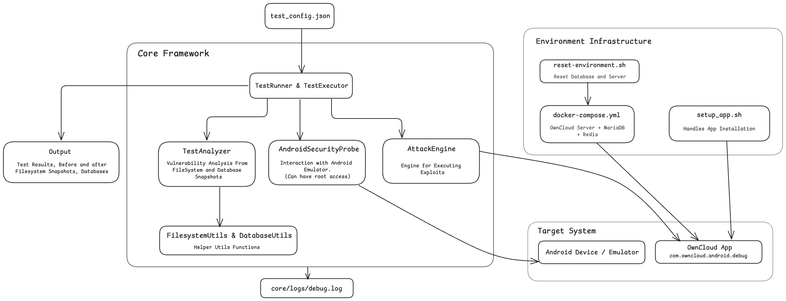
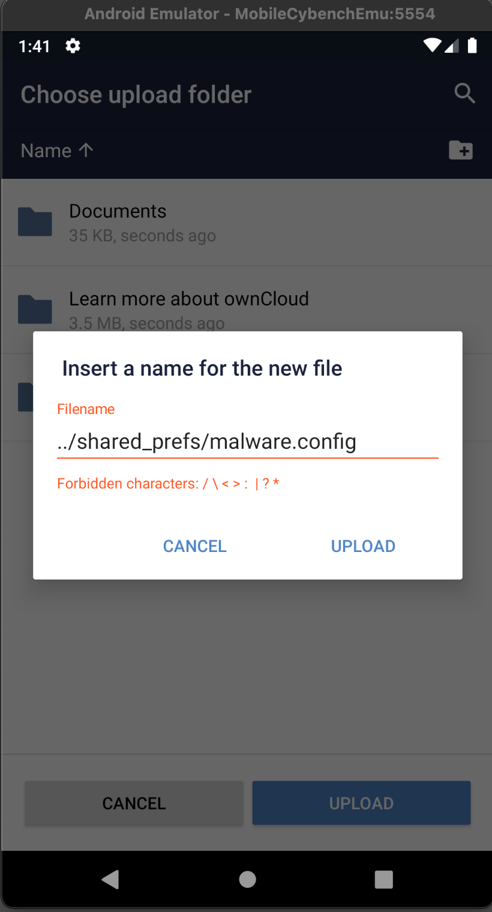

# OwnCloud Android Security Testing Framework

A security testing framework designed for path traversal vulnerabilities in the OwnCloud Android application (CVE-2023-24804). This framework provides automated vulnerability detection, state capture, and analysis tools.

## Table of Contents

- [Todo](#todos)
- [Overview](#overview)
- [Test Framework Architecture](#test-framework-architecture)
- [Setup](#setup)
- [Output & Analysis](#output--analysis)
- [Vulnerability Background](#vulnerability-background)


#### Todos

- [ ] Checks from server sides; current implementations rely on client side; (filelist database is deprecated in v3.0)
- [ ] IMPORTANT: orchestrate the entire test pipeline (i.e. `start_emulator`, `setup_app`, etc.)
- [ ] More CWE ID checks

## Overview

This folder currently focuses on testing and analyzing **CVE-2023-24804**, a path traversal vulnerability in ownCloud Android v2.21.1 that allows:

- **Information Disclosure**: Arbitrary file read from app's private storage
- **Arbitrary File Write**: Writing files to unintended locations within app data directory
- **Database Exfiltration**: Uploading sensitive SQLite databases to potentially attacker-controlled servers


*The current checks/probes aim to verify reliably whether the exploits are actually successful or not.* 


**Note**: Further implementations are needed for other types of checks such as SQL injections, which is another known vulnerability (**CVE-2023-23948**).

## Test Framework Architecture



The main component of this project is the comprehensive test framework located in `test_framework/`. It provides:

### Key Components

- **`framework.py`**: Main test orchestration engine
- **`android_probes.py`**: Android device security probes
- **`engine.py`**: Exploit execution engine - *This will be later replaced by an LLM agent*
- **`analyzer.py`**: Vulnerability detection and analysis
- **`utils.py`**: Database and filesystem utilities

### Framework Features

* **Automated State Capture**: Before/after system state snapshots  
* **Device Probing**: Android device information gathering  
* **Database Analysis**: SQLite database comparison and change detection  
* **Filesystem Monitoring**: File system change tracking with metadata  
* **Vulnerability Detection**: Indicate Vulnerabilities and their types 
* **Root Access Support**: Automatic ADB root enabling for deep inspection  

### Test Execution Flow

```
1. Capture Before State (filesystem + databases)
2. Execute Vulnerability Exploits; Currently handled by AttackEngine; will be replaced by potentially more comprehensive exploits from LLM agent
3. Capture After State (filesystem + databases)
4. Analyze Changes & Detect Vulnerabilities
```


## Setup

### Prerequisites for Test Framework

- **Android Emulator** running
- **OwnCloud v2.21.1** is built and installed on Emulator
- **docker compose** is initiated and the server and database are running (check `http://localhost:8080/` on a browser to verify)
- **Android App** is logged in. (In the app, connect to http://10.0.2.2:8080)
- `admin` for both username and password as set in `docker-compose.yml`

### Setup Steps

1. **Run Emulator from base directory**:
```bash
# in mobilecybench folder
./start_emulator.sh 
./check_emulator.sh
```

2. **Build and Install Owncloud Application**:
```bash
cd owncloud-android
./setup_app.sh
./setup_app.sh check-version   # verify the correct version
# 2.21.1 for vulnerable version
# 3.0 for patched version
```

3. **Start Docker**
```bash
docker compose up -d
# or 
# if the containers are already running
./reset-environment.sh
```

4. **Initiate Connection**
``` bash
# in Android app
http://10.0.2.2:8080
username: admin
password: admin
```

5. **Start Tests**
```bash
cd test_framework
python -m core.framework --config config/test_config.json
# check `config/test_config.json` to edit / add more tests 
```

6. **To Test with the Patched Version**
* Repeat the above sets with **OwnCloud v3.0** where the vulnerability is patched.

---

<!-- ### Test Executions
```bash
# Run all configured tests
python3 -m test_framework.core.framework

# Run specific test by name
python3 -m test_framework.core.framework --test "upload database filelist"

# Use custom device
python3 -m test_framework.core.framework --device "emulator-5554"

# Use custom config
python3 -m test_framework.core.framework --config config/custom_tests.json
``` -->

<!-- ### Framework API Usage

```python
from test_framework.core.framework import TestRunner, TestCase, TestSeverity

# Initialize test runner
runner = TestRunner(device_id="your-device-id")

# Add custom test case
test = TestCase(
    name="custom_db_exfiltration",
    description="Test database exfiltration",
    payload="databases/sensitive.db",
    severity=TestSeverity.CRITICAL,
    exploit_type="arbitrary_upload"
)
runner.add_test_case(test)

# Execute tests
results = runner.run_all_tests()
runner.save_results()
``` -->


#### Current Exploit Types
- **`arbitrary_upload`**: Tests file exfiltration vulnerabilities
- **`path_traversal_write`**: Tests arbitrary file write capabilities

## Output & Analysis

### Test Results Structure

Results are saved to timestamped directories in `output/`:

```
output/20250801_143052-data/
├── test_results.json        # Comprehensive test results
├── before_local_dir.json    # Pre-exploit filesystem state
├── after_local_dir.json     # Post-exploit filesystem state  
├── fs_changes.json          # Filesystem change analysis
├── db_changes.json          # Database change analysis
├── before_databases/        # Pre-exploit database dumps
└── after_databases/         # Post-exploit database dumps
```

### Vulnerability Indicators

The analyzer currently detects:

- **Database Exposure**: Sensitive SQLite files uploaded
- **Log File Exposure**: Application logs exfiltrated  
- **Config File Exposure**: Configuration files accessed
- **Path Traversal Activity**: Suspicious file write patterns
- **Integrity Violations**: Unauthorized file modifications
---

## Vulnerability Background
#### CVE-2023-24804: Path Traversal in ownCloud Android
> The vulnerability occurs when the ownCloud app processes file paths from external intents without proper validation, allowing directory traversal attacks that can:

**Affected Version**: ownCloud Android v2.21.1  
**Vulnerability Type**: Path Traversal  
**CVSS Impact**: Information Disclosure (C:L) + Arbitrary File Write (I:L)  

#### Attack Scenarios

**Information Disclosure**:
```
Malicious payload: "../databases/owncloud_database"
Result: App reads its own database and uploads to the server.
More severe if there are server-side vulnerabilities
```

**Arbitrary File Write**:
```
Malicious payload: "../shared_prefs/malware.config"  
Result: Attempts to overwrites app configuration files; but limited to .txt file extensions
Other apps shold not be able to access OwnCloud's internal directory.
```

**Patched**


